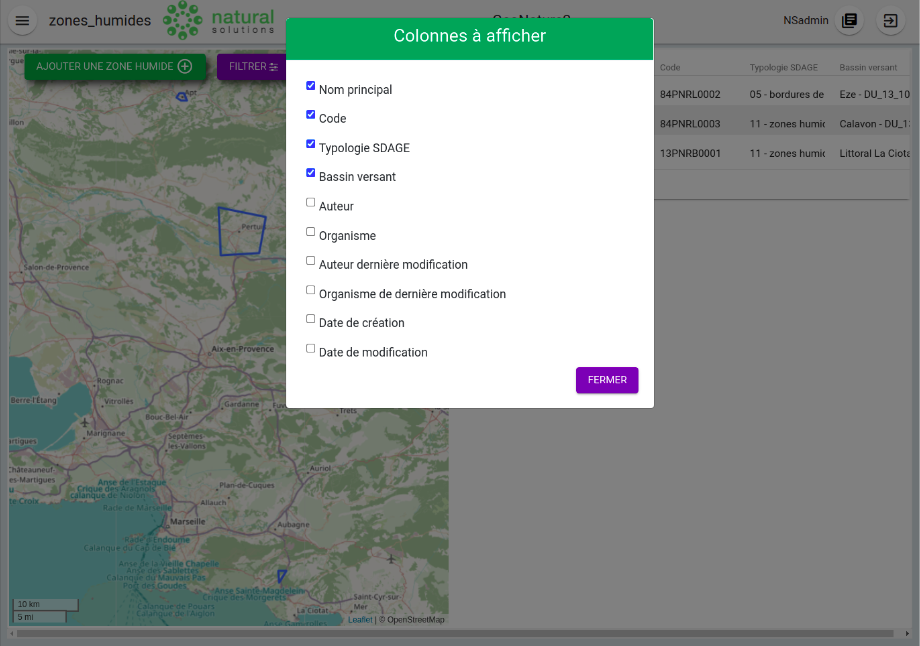
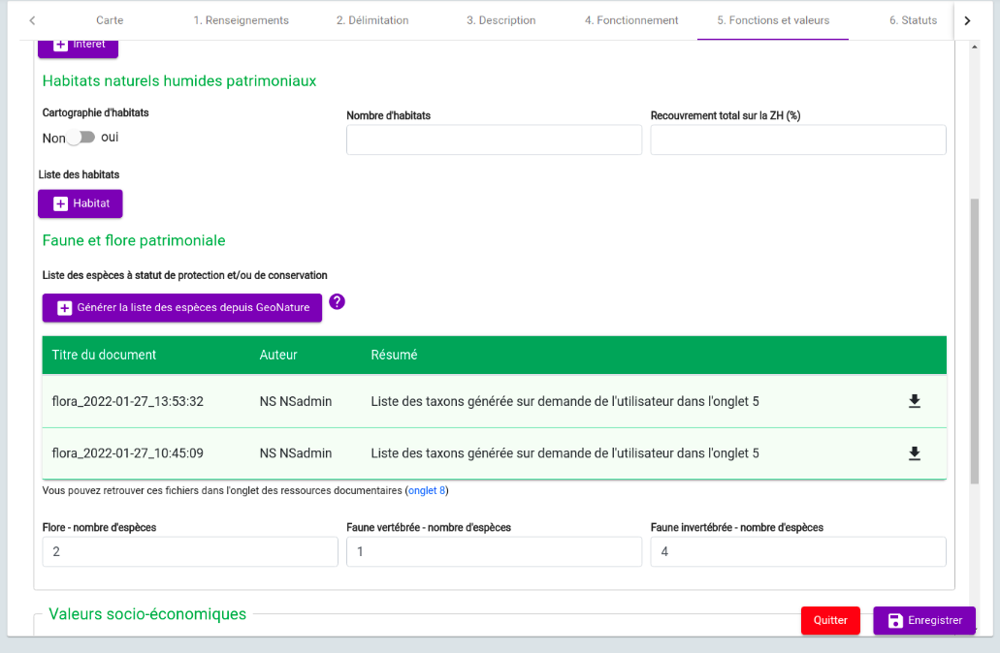

# **DOCUMENTATION ADMINISTRATEUR**

## **1 - Modification des paramètres du module**

Vous pouvez modifier la configuration du module en créant un fichier `zones_humides_config.toml` dans le dossier `config` de GeoNature, en vous inspirant du fichier `zones_humides_config.toml.example` et en surcouchant uniquement les paramètres que vous souhaitez.

## **2 - Affichage de la liste des zones humides**

L'administrateur peut modifier les colonnes de la liste des zones humides affichée sur la page d'accueil. Cela est possible grâce au paramètre `available_maplist_column` qui contient la liste des colonnes que le backend envoie au frontend. La clé `prop` doit avoir pour valeur un nom de la colonne de la table `pr_zh.t_zh`. La clé `name` a pour valeur le nom de la colonne à afficher en frontend. A noter que la liste des colonnes obtenues en cliquant sur le picto  dans le tableau en frontend correspond à la liste des colonnes listées dans `available_maplist_column`.

Le paramètre `default_map_list_conf` contient la liste des colonnes affichées en front. Il faut que les colonnes listées dans ce paramètre soient présentes dans `available_maplist_column`.

## **3 - Les nomenclatures**

Le paramètre `nomenclatures` contient la liste des éléments de nomenclatures contenus dans la table `ref_nomenclatures.t_nomenclatures` et envoyés vers le frontend. Les termes utilisés dans la liste correspondent pour la quasi-totalité à ceux utilisés dans la colonne mnemonique de la table `ref_nomenclatures.bib_nomenclatures_types`. Si une nomenclature évolue, il suffit donc de modifier en base de données la table `ref_nomenclatures.t_nomenclatures` (ex : modification de label, suppression/ajout d’élément, …). Ces modifications seront alors reportées directement au frontend (ex : contenu des listes déroulantes, …).

## **4 - Les référentiels géographiques**

Le paramètre `ref_geo_referentiels` contient la liste des inventaires intersectant le territoire de la ZH qui doivent être recherchés et fournis dans la section 6 de la fiche complète. Il est possible de retirer ou ajouter des inventaires : 

Si l'administrateur veut en ajouter un, il doit d'abord vérifier s'il existe dans la table `ref_nomenclatures.bib_nomenclatures_types`, sinon l'ajouter à cette table. Il doit ensuite vérifier si les objets géographiques (notamment les géométries) liés à ce type d'inventaire sont insérés dans la table `ref_geo.l_areas`, sinon les ajouter à cette table. Ensuite, reporter la valeur de la colonne `type_code` de la table `ref_nomenclatures.bib_nomenclatures_types` comme valeur de la clé `type_code_ref_geo` et mettre la clé `active=True` dans le fichier de configuration.  

Si l'administrateur désire qu'un inventaire n'apparaisse plus dans la section 6 de la fiche complète, il suffit de mettre `active=False`.  

## **5 - Téléchargement des listes de taxons**

### Fonctionnement

Lorsque l'utilisateur clique sur "générer la liste des espèces" dans l'onglet 5, l'application génère 3 fichiers csv correspondant aux taxons de flore, faune vertébrée et invertébrée protégés et observés au sein du périmètre de la zone humide. Voir la documentation utilisateur du module pour plus de détails sur les critères retenus pour la composition de cette liste. A noter qu’il s’agit d’une liste de taxons et non pas d’une liste d’occurrences de taxons (les observations liées à 1 taxon représentent donc 1 seule ligne). Chaque clic sur le bouton génère les fichiers, ces derniers étant stockés sur le serveur (et donc constamment disponibles au téléchargement) dans le dossier `static`.  

Par défaut, les 3 vues matérialisées (`vertebrates_view_name`, `invertebrates_view_name` et `flore_view_name`) sont paramétrées pour : 

- lister les taxons présents dans la synthèse GeoNature de l'instance sur laquelle est déployé le module ZH. Les vues matérialisées utilisent donc la table `gn_synthese.synthese` en base de données. 
- utiliser les statuts d’évaluation, protection et menace listés dans la table `taxonomie.bdc_statut`

### Changer la source des données

Si l'administrateur veut changer la source de données, par exemple se brancher sur la synthèse d'une autre instance en configurant un foreign data wrapper, il devra supprimer les vues déjà existantes en base de données puis les recréer en respectant leur structure :

- `id_zh` - integer : id de la zh concernée 
- `cd_nom` - integer : cd_nom du taxon 
- `group_class` - character varying (50) : classe du taxon 
- `group_order` - character varying (50) : ordre du taxon 
- `scientific_name` - character varying (500) : nom scientifique du taxon 
- `vernac_name` - character varying (1000) : nom vernaculaire du taxon 
- `statut_type` - character varying (250) : type de statut d’évaluation, de protection et/ou de menace 
- `statut` - text : détail du statut d’évaluation, de protection et/ou de menace du taxon 
- `article` - text : références de l’article détaillant le statut 
- `doc_url` - text : url vers l’article 
- `last_date` – timestamp without time zone : date de dernière observation du taxon 
- `observer` - character varying (1000) : nom et prénom de l’observateur 
- `organisme` - character varying (500) : organisme de l’observateur 
- `obs_nb` - integer : nombre d’observations 

L’association `id_zh`/`cd_nom` doit être unique puisque la vue liste les taxons protégés présents dans chaque zone humide.  

Le script `data/script_create_taxon_view.sh` permet d’aider la génération des vues matérialisées en indiquant la table source des occurrences de taxons et la table listant les statuts d’évaluation, protection et menaces. Etant donné que par défaut les vues matérialisées sont construites sur la base de la structure des tables `gn_synthese.synthese` et `taxonomie.bdc_statut` de GeoNature, ce script fonctionne de manière optimale en utilisant des sources de données dont la structure est identique, c’est-à-dire provenant de GeoNature, que ce soit en local (= l’instance sur laquelle est installé le module ZH) ou à l’extérieur (ex : un foreign data wrapper vers les données d’un autre GeoNature). Si l’administrateur désire utiliser d’autres sources de données structurées différemment, il devra modifier le code sql de ce script pour obtenir la structure attendue (décrite ci-dessus) des vues.

### Rafraichissement des vues matérialisées

Les vues matérisalisées sont mises à jour automatiquement à fréquence définie, par défaut toutes les 12 heures. Si toutefois, vous souhaitez diminuer ou augmenter la durée entre chaque mise à jour, définissez cette dernière dans le fichier de configuration (``zones_humides_config.toml``) dans la variable ``TAXON_VM_CRONTAB``.
  
     TAXON_VM_CRONTAB ="0 0,12 * * *"

Ce paramètre est composé de cinq valeurs, chacune séparée par un espace: minute, heure, jour du mois, mois de l'année, journée de la semaine. Dans l'exemple ci-dessus, il est indiqué que la mise à jour sera effectuée toutes les 12 heures. Pour plus d'informations, vous pouvez consulter la documentation de Celery à ce sujet : https://docs.celeryq.dev/en/stable/userguide/periodic-tasks.html#crontab-schedules.

**Note** : Si vous ne voulez pas définir un des paramètres de périodicité, utilisez un astérisque (``*``).

## **6- Les ressources documentaires**

Les fichiers uploadés par l'utilisateur dans l'_onglet 8 – ressources documentaires_ doivent respecter des règles par défaut :

- les extensions acceptées sont ".pdf" et ".jpg" 
- la taille maximale du fichier doit être de 1,5 Mo pour les pdf et 0,5 Mo pour les jpg.  
- les noms de fichiers jpg doivent respecter le format suivant : codeZH_numeroPhoto 
- l'administrateur peut modifier ces valeurs dans les paramètres `allowed_extensions`, `max_pdf_size`, `max_jpg_size`. Il peut également supprimer les vérifications de nom de fichier et d'extensions en modifiant les paramètres `filename_validated` et `fileformat_validated`.  

## **7- La fiche de synthese en pdf**

La fiche de synthese en pdf peut se télécharger dans la fiche complète. Il est possible d’insérer une image à la fin du pdf (par exemple un bandeau jpg illustrant les différents partenaires) en indiquant le nom de l’image comme valeur du paramètre `pdf_last_page_img`. L’image doit être insérée dans le répertoire `static` du module.  

## **8- Paramétrage des règles pour les calculs de la hiérarchisation**

Voir le document dédié : [hiérarchisation](/doc/hierarchy.md)

## **9- Gestion des ressources bibliographiques**

Dans la version actuelle du module, la création d'une référence bibliographique se fait directement en base de données. L'utilisateur a donc seulement la possibilité de lier une référence existante à une zone humide (onglet 1). Si la référence dont l'utilisateur a besoin est manquante dans l'autocomplete _Références bibliographiques_ de l'onglet 1, il doit s'adresser à l'administrateur pour que celui-ci l'ajoute. 

L'administrateur doit donc remplir la table `pr_zh.t_references`, dont seulement le champ `titre` est à renseigner obligatoirement, pour ajouter une référence bibliographique. 

## **10- Configurer un export de données**

Le module export de GeoNature peut être utilisé. Voir son fonctionnement [ici](https://github.com/PnX-SI/gn_module_export)

## **11- Gestion des fonds cartographiques**

Les fonds cartographiques sont configurés au niveau du fichier de laconfiguration GeoNature (voir exemple de _MAPCONFIG_ [ici](https://github.com/PnX-SI/GeoNature/blob/master/config/default_config.toml.example#L188)) - donc hors de la configuration du module. Cette configuration permet d'avoir accès à différents fonds de carte au sein du module :

- sur la page d’accueil
- sur la page de création d’une ZH (onglet "Carte")
- sur la fiche complète
