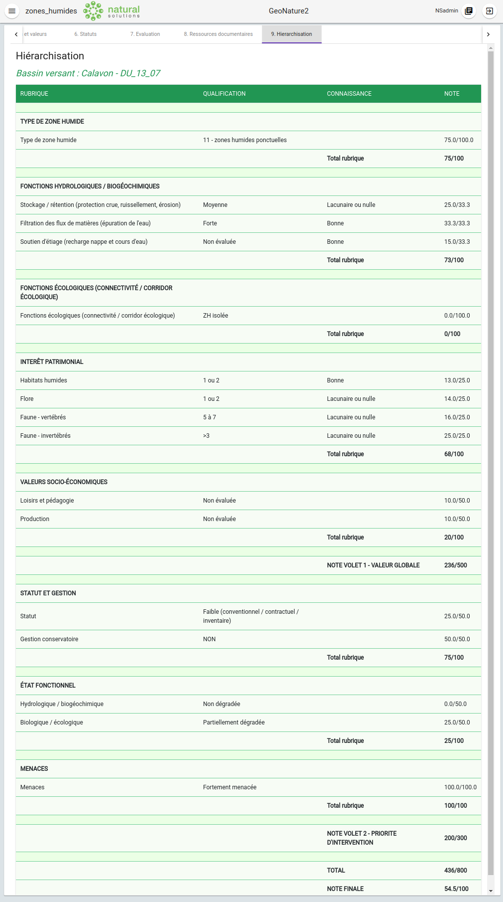
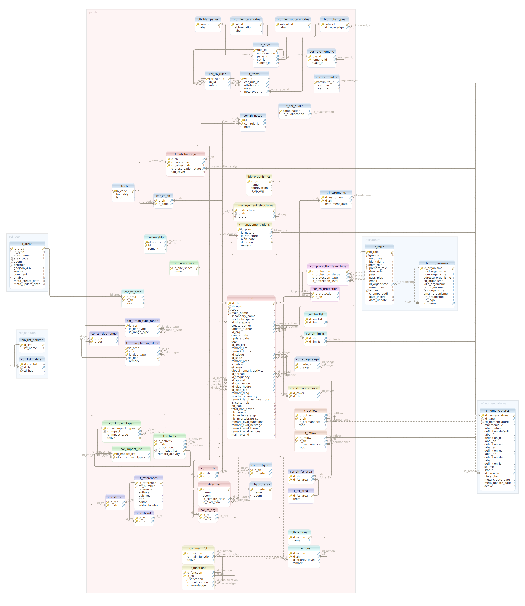

# **HIERARCHISATION DES ZONES HUMIDES**

&nbsp;

## **Principes généraux de la hiérarchisation**

La hiérarchisation est un ordonnancement des zones humides au sein d'un bassin versant selon une note. Cette hiérarchisation intervient à l’onglet 9 du module dans lequel est générée automatiquement une note globale pour une zone humide à partir des valeurs des champs saisies par l’utilisateur aux onglets précédents (1 à 8). Cette note est calculée à partir de **règles** communes pour les zones humides d’un **même bassin versant** (les règles peuvent différer d’un bassin versant à l’autre).

La note globale est obtenue à partir d’un maximum de 16 règles articulées en **volets**, **rubriques** et **sous-rubriques** (voir le liste dans [volet 1](#volet1) et [volet 2](#volet2)). Selon les cas, une règle peut correspondre à une rubrique entière, par exemple "Type de zone humide", ou à une sous-rubrique, par exemple "flore". Chaque règle fait l’objet d’une note.

Chaque bassin versant est libre d’avoir la combinaison de règles (parmi les 16 disponibles) qui semble la plus pertinente pour son système de hiérarchisation des zones humides. La note globale finale (sur 100) prend en compte les notes de toutes les règles choisies (la note maximale de chaque rubrique étant de 100).

&nbsp;

**_Volet 1 – Valeur globale :_**

| Rubrique                                                   | Sous-Rubrique                                                                                                                                                                                          |
| ---------------------------------------------------------- | ------------------------------------------------------------------------------------------------------------------------------------------------------------------------------------------------------ |
| Type de zone humide                                        | _Pas de sous-rubrique_                                                                                                                                                                                 |
| Fonctions hydrologiques / biogéochimiques                  | <ul><li>Stockage / rétention (protection crue, ruissellement, érosion)</li><li>Filtration des flux de matières (épuration de l'eau)</li><li>Soutien d'étiage (recharge nappe et cours d'eau)</li></ul> |
| Fonctions écologiques (connectivité / corridor écologique) | _Pas de sous-rubrique_                                                                                                                                                                                 |
| Intérêt patrimonial                                        | <ul><li>habitats humides</li><li>flore</li><li>faune - vertébrés</li><li>faune - invertébrés</li></ul>                                                                                                 |
| Valeurs socio-économiques                                  | <ul><li>Loisirs et pédagogie</li><li>Production</li>                                                                                                                                                   |

&nbsp;

**_Volet 2 – Priorité d’intervention :_**

| Rubrique          | Sous-Rubrique                                                              |
| ----------------- | -------------------------------------------------------------------------- |
| Statut et gestion | <ul><li>Statut</li><li>Gestion conservatoire</li>                          |
| Etat fonctionnel  | <ul><li>Hydrologique / biogéochimique</li><li>Biologique / écologique</li> |
| Menaces           | _Pas de sous-rubrique_                                                     |

&nbsp;

Les différences de systèmes de hiérarchisation entre les bassins versants peuvent donc porter sur :

- **les règles incluses ou non dans le calcul** : il n’est pas obligatoire que la note globale utilise les 16 règles. Il est possible d’exclure les règles qui ne semblent pas pertinentes pour le bassin versant étudié.

- **le système de notes mis en place pour chaque règle** : une liste de valeurs possibles est définie pour chaque règle. Ces valeurs sont appelées **qualifications**.  
  Pour une zone humide, la détermination de la qualification pour chaque règle du bassin versant auquel elle appartient est automatiquement effectuée à partir le remplissage des champs des onglets 1 à 7. Pour chaque qualification est prévue une note qui varie selon les bassins versants.  
  Par exemple, pour la règle "Type de zone humide" (rubrique), les qualifications possibles correspondent à une liste de SDAGE, et pour chaque SDAGE est prévue une note. Donc si l’utilisateur a défini préalablement dans l’onglet 3 que le SDAGE de la zone humide est "11 – zones humides ponctuelles", la zone humide obtiendra par exemple une note de 75/100 à cette rubrique dans le cas du bassin versant du Calavon. En effet, pour ce bassin versant il a été défini que "11 – zones humides ponctuelles" correspond à une note de 75 pour la rubrique "Type de zone humide".

- En plus des qualifications, certaines règles prévoient également la détermination d’un niveau de **connaissance**. Selon la détermination de la connaissance ("lacunaire ou nulle" ou "bonne"), la note de la qualification va augmenter ou baisser.

Pour plus de détails méthodologiques et théoriques sur la hiérarchisation des zones humides, se reporter au document :
{- ‘tuto expert’ (le mettre disponible quelque part) -}

&nbsp;

## **Hiérarchisation dans le module Zones Humides**

&nbsp;

### **Tables et modèle de données**

Onze tables du schéma pr_zh sont dédiées au fonctionnement de la hiérarchisation dans la base de données GeoNature. Parmi elles, 4 sont destinées à être remplies par l’administrateur pour implémenter les règles de hiérarchisation des différents bassins versants. Les autres tables n’ont pas vocation à être modifiées quel que soit le système de hiérarchisation et le bassin versant concerné.

#### _Les tables non concernées par l'implémentation des règles par l'administrateur :_

Les tables **pr_zh.bib_hier_panes**, **pr_zh.bib_hier_categories** et **pr_zh.bib_hier_subcategories** listent les volets, rubriques et sous-rubriques.

La table **pr_zh.t_rules** comporte 16 lignes, correspondant aux 16 règles qu’il est possible de choisir pour chaque bassin versant. Elle permet de mettre en relation les 16 règles avec les volets, rubriques et sous-rubriques (par des clés étrangères vers ces tables).

La table de correspondance **pr_zh.cor_rule_nomenc** permet de définir pour certaines règles quels éléments de nomenclatures correspondent à un certain niveau de qualification.  
Par exemple, pour la sous-rubrique "statut" de la rubrique "statut et gestion", l’élément "18 – Espace Boisé Classé" de la nomenclature "Statut de protection", correspond au niveau de qualification "Faible (conventionnel / contractuel / inventaire)". Le contenu pr_zh.cor_rule_nomenc est commun à tous les bassins versants, c’est pourquoi elle ne fait pas partie des tables à remplir/modifier pour implémenter les règles de hiérarchisation pour un bassin versant. Grâce à cette table, l’administrateur peut néanmoins modifier/supprimer/ajouter des correspondances si besoin, mais en gardant en tête que ces modifications impacteront toutes les hiérarchisations, **quel que soit le bassin versant**.

La table **pr_zh.t_cor_qualif** permet d’attribuer un niveau de qualification global à une combinaison de qualifications renseignées par l’utilisateur. Par exemple, dans le cas où 5 valeurs socio-économiques ont été remplies par l’utilisateur dans l’onglet 5 : si 3 valeurs socio-économiques ont un niveau de qualification à "non évaluée", 1 valeur socio-économique à "faible" et 1 à "forte", la valeur correspondante dans la colonne _pr_zh.t_cor_qualif.combination_ est "3101" (= 3 NE, 1 faible, 0 moyenne, 1 forte) et correspond à une qualification globale "moyenne" pour la colonne _pr_zh.t_cor_qualif.id_qualification_ (clé étrangère vers **ref_nomenclatures.t_nomenclatures**). Ici aussi l’administrateur peut modifier/supprimer/ajouter des correspondances si besoin mais toutes les hiérarchisations, **quel que soit le bassin versant**, seront impactées.

&nbsp;

#### _Les tables modifiables par l'administrateur pour implémenter les règles :_

La table **pr_zh.cor_rb_rules** permet de lister les règles qui vont être prises en compte pour la hiérarchisation au sein de chaque bassin versant (par une clé étrangère vers pr_zh.t_rules.rule_id et une clé étrangère vers pr_zh.t_river_basin.id_rb).

La table **pr_zh.t_items** permet de définir le fonctionnement de chaque règle listée dans pr_zh.cor_rb_rules (clé étrangère vers pr_zh.cor_rb_rules.cor_rule_id). On peut ainsi indiquer :

- la liste des qualifications prises en compte pour chaque règle :
  Par exemple, si on a indiqué précédemment dans t_rules que le SDAGE d’une zone humide va être un critère de hiérarchisation, on peut lister ici quels sont les SDAGE pris en compte (chaque ligne correspondant à un SDAGE). Les qualifications sont définies par des clés étrangères vers **ref_nomenclatures.t_nomenclatures** (car tous les référentiels, comme celui des SDAGE, sont intégrés à ref_nomenclatures.t_nomenclatures lors de l’installation du module zones_humides et ont un id_nomenclature unique qui est utilisé comme clé primaire).
- la note attribuée à chaque qualification en fonction du niveau de connaissance s’il en existe une pour la règle concernée (clé étrangère vers la table **pr_zh.bib_note_type** qui liste les 3 valeurs de connaissance d’un critère : 1 pour « Lacunaire ou nulle», 2 pour « Bonne » et 0 si nulle)

La table **pr_zh.cor_item_value** permet d’attribuer des valeurs aux qualifications qui nécessitent une quantification. Par exemple, la règle « nombre d’espèces de flore » observées au sein d’une zone humide a une qualification « 3 à 5 » (entre autres) dans le cas du bassin versant du Calavon. On reportera donc dans pr_zh.cor_item_value que cette qualification (qualification identifiée par une clé étrangère vers **ref_nomenclatures.t_nomenclatures**) a une valeur minimale de 2 et maximale de 5. Ceci permet de déterminer à quelle qualification correspondant le nombre d’espèces saisi dans l’onglet 5.

&nbsp;

## **Implémentation des règles de hiérarchisation pour un bassin versant en base de données**

L’implémentation des règles de hiérarchisation pour chaque bassin versant doit être effectuée **directement en base de données par l’administrateur** dans les tables du schéma _pr_zh_ citées précédemment. **Il n’existe pour l’instant pas d’interface graphique permettant de faciliter cette tâche**.

**Etape 1** - Vérifier que les informations concernant le bassin versant pour lequel les règles de hiérarchisation vont être implémentées sont correctement remplies dans la table _pr_zh.t_river_basin_ : un id de bassin versant (_id_rb_), un nom et une géométrie (= contour).

**Etape 2** - Remplir _pr_zh.cor_rb_rules_ pour indiquer les règles qui vont être utilisées pour le bassin versant concerné : chaque ligne correspond à l’identifiant du bassin versant (_id_rb_) et l’identifiant de la règle (_pr_zh.t_rules.id_rule_).

**Etape 3** - Compléter la table _ref_nomenclatures.t_nomenclatures_ pour les qualifications qui ne sont pas déjà présentes dans la table.

Par exemple, pour la rubrique "Type de zone humide", les qualifications existent déjà puisque la liste des SDAGE a été insérée au moment de l’installation du module. En revanche, pour d’autres règles, par exemple le "nombre d’espèces de flore", les choix ne sont probablement pas déjà insérés dans _ref_nomenclatures.t_nomenclatures_, surtout s’il s’agit d’une première implémentation de règles pour un bassin versant. Pour cet exemple, on insérera donc les qualifications nécessaires dans _ref_nomenclatures.t_nomenclatures_ (avec un _id_type_ correspondant à "HIERARCHISATION" dans la table _ref_nomenclatures.bib_nomenclature_types_) : "Aucun", "1 ou 2", "3 à 5", "> 5" dans le cas du bassin versant du Calavon.

**Etape 4** – Remplir _pr_zh.t_items_ pour définir le contenu de chaque règle du bassin versant :

- _val_id_: un id unique par ligne
- _cor_rule_id_ : identifiant de la règle (clé étrangère vers _pr_zh.cor_rb_rules_)
- _attribute_id_ : identifiant de la qualification (clé étrangère vers _ref_nomenclatures.t_nomenclatures_)
- _note_ : note attribuée pour la qualification
- _note_type_id_ : indiquer à quel niveau de connaissance correspond la note

**Etape 5** – Remplir _pr_zh.cor_item_value_ pour les qualifications qui nécessitent une quantification

&nbsp;

Parallèlement au remplissage de ces tables, l’administrateur peut contrôler et visualiser son travail d'implémentation en consultant 2 vues :

- **pr_zh.all_rb_rules** : contient la liste des règles pour chaque bassin versant accompagnées de leur qualifications et connaissances en français (et non pas les id comme pour les tables). Permet à l’administrateur de voir la création des règles au fur et à mesure de leur implémentation.
- **pr_zh.rb_notes_summary** : contient pour chaque bassin versant le total des notes de chaque volets et rubriques. Permet à l’administrateur d’avoir une vue d’ensemble et de contrôler le poids donné à chaque rubrique.

&nbsp;

Pour faciliter la compréhension et avoir plus de détails sur le fonctionnement de la hiérarchisation et de l’implémentation des règles en BDD, voir :

- [la partie "Implémentation des règles en BDD"](#implementation)
- [l'implémentation des règles du bassin versant du Calavon](https://github.com/PnX-SI/gn_module_ZH/blob/dev/data/insert_into_fake_data.sql)
- {- quand dispo insérer le pdf tutoriel expert `[à insérer ici`](https://geonature.fr/documents/) pour un détail complet de la méthodologie de hiérarchisation -}

&nbsp;

## **Implémentation des règles en BDD rubrique par rubrique**

Les différentes rubriques sont plus ou moins personnalisables/paramétrables par l’administrateur :

- la rubrique "**Types de zone humide**" :
  - **qualification** : l’administrateur peut entièrement paramétrer cette rubrique en définissant dans pr_zh.t_items quels SDAGE sont retenus pour le bassin versant concerné et indiquer la note correspondant à chaque SDAGE. La liste complète des SDAGE est déjà insérée (au moment de l'installation du module) dans ref_nomenclatures.t_nomenclatures, donc pas d’action nécessaire sur cette table.
  - **connaissance**: pas de niveau de connaissance à définir pour cette rubrique.

- la rubrique "**Fonctions hydrologiques / biogéochimiques**" :
  - **qualifications**: pour chaque sous-rubrique, il s’agit de prendre en compte des qualifications ou combinaisons de qualifications renseignées dans l’onglet 5 par l’utilisateur. Comme indiqué dans la partie "Tables et modèle de données", l’interprétation de ces choix (pour la qualification et la fonction) est faite en fonction de valeurs contenues dans 2 tables fixes, **pr_zh.t_cor_qualif** et **pr_zh.cor_rule_nomenc**. Ces valeurs sont donc communes à tous les bassins versants et l’administrateur n’a donc pas à s’en soucier lors de l’implémentation des règles de hiérarchisation. De plus, les termes utilisés pour les qualifications sont normalement déjà insérés dans ref_nomenclatures.t_nomenclatures (ex : ‘Nulle à faible’, ‘Forte’, …). L’administrateur aura donc probablement pour cette rubrique uniquement à renseigner les notes correspondant à chaque niveau de qualification et de connaissance dans pr_zh.t_items.

- la rubrique "**Fonctions écologiques (connectivité / corridor écologique**" :
  - **qualification**: A priori, les termes de qualification utilisés pour cette rubrique (« ZH isolée » ou « ZH participant d’un réseau ou continuum » ne seront pas présents dans ref*nomenclatures.t_nomenclatures lors de la 1ère implémentation, il faudra donc les insérer dans la table (en indiquant l’\_id_type* correspondant à ‘HIERARCHY’ dans ref_nomenclatures.bib_nomenclatures_types – clé étrangère). Pour définir si une zone humide est isolée ou participant d’un réseau ou continuum, les valeurs sont fixes et définies dans pr_zh.cor_rule_nomenc.
  - **connaissance**: Pas de niveau de connaissance défini pour cette rubrique. L’administrateur a donc uniquement à indiquer dans pr_zh.t_items les notes à attribuer pour chacun des 2 choix possibles.

- la rubrique "**Intérêt patrimonial**" : chaque sous-rubrique est presque entièrement paramétrable par l’administrateur (sauf pour les connaissances).
  - **qualification**: Les niveaux de qualifications (ex : « 3 à 5 », « Aucun », …) doivent être ajoutés dans ref_nomenclatures.t_nomenclatures s’ils ne sont pas déjà présents. Les bornes des qualifications (ex : 3 et 5 pour la qualification "3 à 5") doivent être également reportées par l’administrateur dans pr_zh.cor_item_values pour pouvoir être quantifiées. L’administrateur doit ensuite remplir pr_zh.t_items pour indiquer les notes à attribuer pour chaque qualification et connaissance.
  - **connaissance**: les niveaux de connaissance sont en revanche fixes et communs à tous les bassins versants, donc l’administrateur n’a pas à s’en soucier.

- la rubrique "**Valeurs socio-économiques**" :
  - **qualification**: là aussi, pour les 2 sous-rubriques, il s’agit de prendre en compte des qualifications ou combinaisons de qualifications renseignées dans l’onglet 5 par l’utilisateur. Il s’agit de critères fixes communs à tous les bassins versants. L’administrateur aura donc probablement pour cette rubrique uniquement à renseigner les notes correspondant à chaque niveau de qualification et de connaissance dans pr_zh.t_items.
  - **connaissance**: pas de niveau de connaissance associé aux qualifications de cette rubrique.

- la rubrique "**Statut et gestion**" :
  - **qualification**: pour les 2 sous-rubriques, il s’agit de prendre en compte des informations remplies dans l’onglet 6 pour déterminer des niveaux de qualifications. La détermination se fait en fonction du contenu de la table fixe pr_zh. pr_zh.cor_rule_nomenc. L’administrateur aura donc à insérer les termes de qualifications adéquats dans ref_nomenclatures.t_nomenclatures, et remplir pr_zh.t_items pour renseigner la note de chaque qualification.

- la rubrique "**Etat fonctionnel**" :
  - **qualification** : les niveaux de qualification des 2 sous-rubriques reprennent exactement les valeurs remplies dans « diagnostic fonctionnel » de l’onglet 4 (donc les termes de qualification sont déjà présents dans ref_nomenclatures.t_nomenclatures). L’administrateur a donc seulement à renseigner les notes dans pr_zh.t_items.
  - **connaissance** : pas de niveau de connaissance pour cette rubrique.

- la rubrique "**Menaces**" :
  - **qualification** : comme pour la rubrique précédente, le niveau de qualification reprend exactement les valeurs remplies dans "Evaluation globale des menaces potentielles ou avérées" de l’onglet 3 (donc les termes de qualification sont déjà présents dans ref_nomenclatures.t_nomenclatures). L’administrateur a donc seulement à renseigner les notes dans pr_zh.t_items.
  - **connaissance** : pas de niveau de connaissance pour cette rubrique.

{- Consulter [le tuto expert](https://geonature.fr/documents/) pour plus les détails méthodologiques complets. -}
